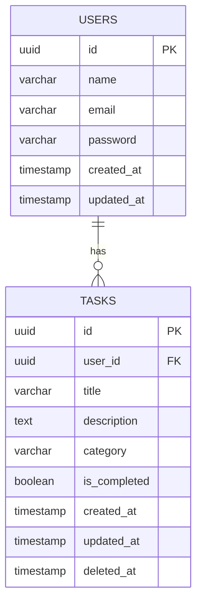
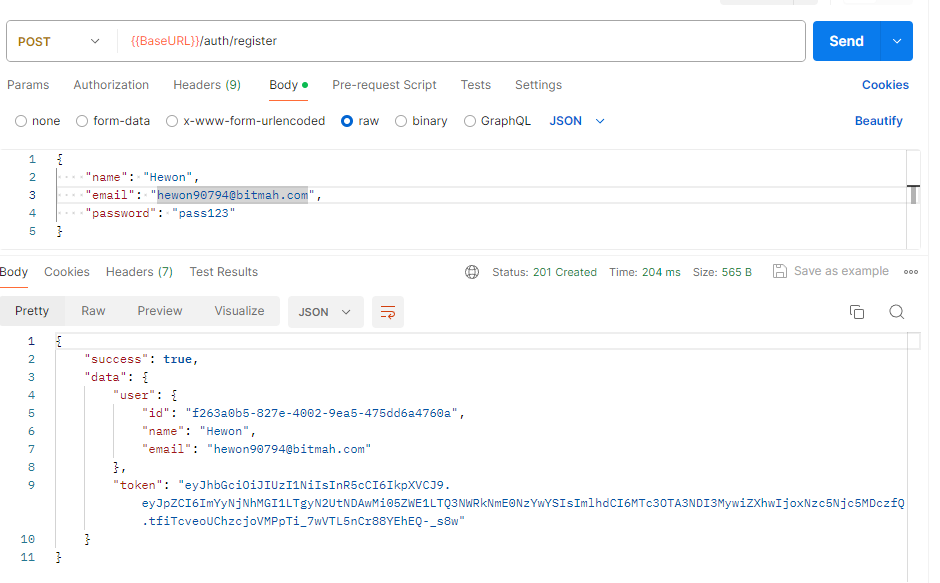
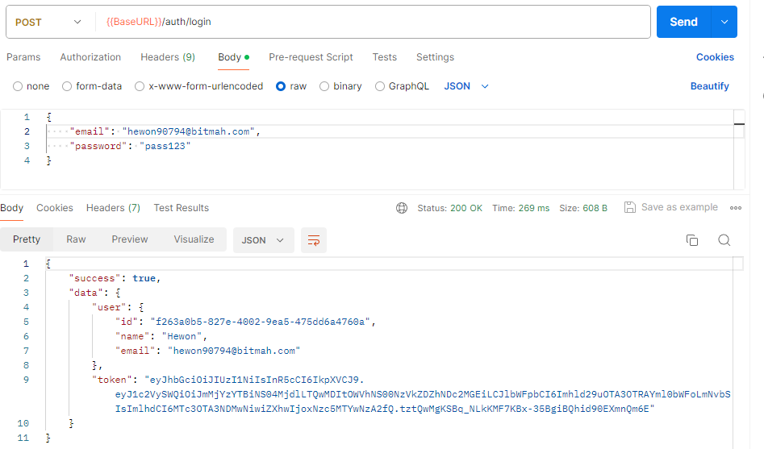
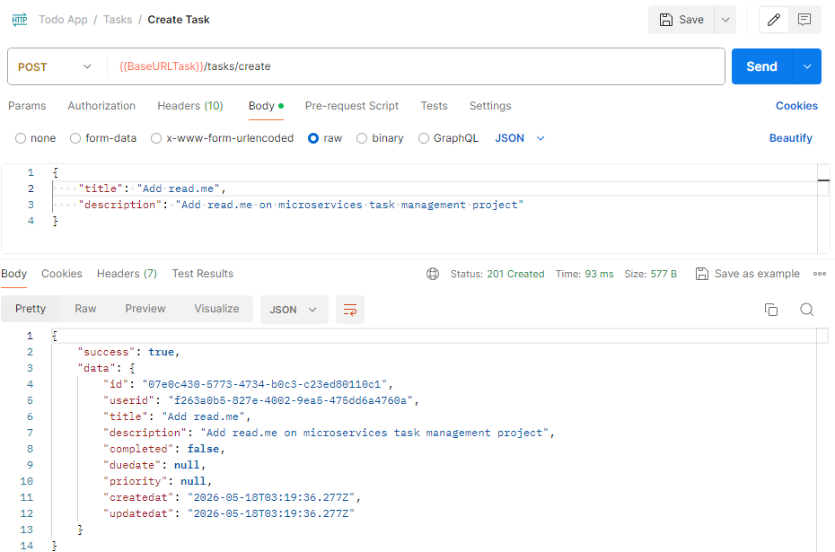
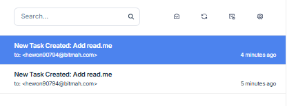
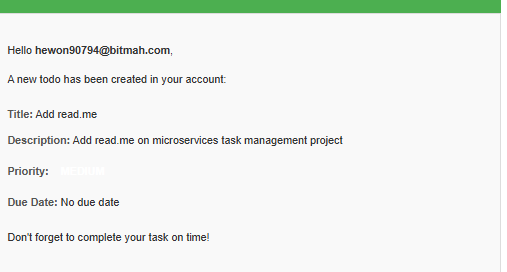

# Microservices Task Management

Backend Task Management System built with a microservices architecture using Node.js, Express, PostgreSQL, and RabbitMQ.

## Features

### Authentication

- User registration
- User login
- JWT authentication
- Password hashing
- Validation handling

### Task

- Create task
- Get all tasks
- Get task by ID
- Update task
- Delete task
- Filter by category
- Search feature

## Flow Overview

# Request Flow

- User Register -> Save to database
- User Login -> Response with token
- Create Task -> Save to database
- Task created notification received on email

# Event Flow

- Task Service -> task.created event -> Event Bus -> Notification Service -> Send Email

## Tech Stack

- Node.js
- Express.js
- PostgreSQL (raw SQL)
- RabbitMQ
- JWT Authentication
- Microservices Architecture
- Event-Driven Communication

## ERD Diagram

## API Endpoints

### Auth

- POST /auth/register -> Register new user
- POST /auth/login -> Login user

### Task

- POST /tasks -> Create empty task
- GET /api/tasks-> Get all tasks
- GET /api/tasks/:id -> Get task by id
- PUT /api/tasks/:id -> Update task
- DELETE /api/tasks/:id -> Delete task

## Learning Goals

This project was built to deepen understanding of:

- Microservices architecture
- Event-driven systems
- RabbitMQ messaging
- Raw PostgreSQL queries
- Backend scalability concepts
- Service separation & communication

## Testing

Tested manually using Postman

### Register

### Login

### Create

### Email

## Author

Built as part of backend learning journey, by Sarah Nur Haibah
